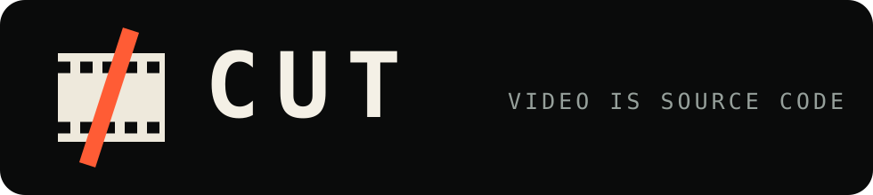

<p align="center">
  
</p>

<h1 align="center">Video is source code.</h1>

<p align="center">
  A typed language and deterministic runtime for audiovisual editing.
</p>

<p align="center">
  <a href="#install">Install</a> ·
  <a href="docs/FIRST_USE.md">Quickstart</a> ·
  <a href="docs/README.md">Documentation</a> ·
  <a href="docs/SPEC.md">Language specification</a> ·
  <a href="docs/ALPHA_FEEDBACK.md">Give feedback</a>
</p>

CUT turns concise `.cut` source into reproducible frames, audio, previews, and
final deliveries. Media, fonts, packages, and runtime identities are locked before
the program is compiled to CutAVIR and rendered.

> **Alpha:** CUT is usable for local experimentation, but its language and package
> formats may still change. macOS arm64 is the officially supported target, with
> maintained Node.js 24 (or Node.js 20.19+ compatibility) and FFmpeg 7 as its
> release baseline. Linux source and package execution is experimental. Performance
> on complex retained compositions remains a known limitation.

## Why CUT?

- **Source instead of timelines:** edits, layouts, motion, audio routing, captions,
  and outputs live in reviewable text.
- **Typed semantics:** time, length, ratios, gain, loudness, and media assets are
  checked before rendering.
- **Locked inputs:** media, fonts, packages, and runtime identities are hash-bound
  in `cut.lock`.
- **Deterministic tooling:** format, check, lint, inspect, diff, frame, contact,
  audition, preview, and render use the same compiled graph.
- **Reusable building blocks:** local modules and CUT packages provide components
  without executing arbitrary JavaScript.

## Install

Requirements:

- macOS on Apple silicon (official) or Linux (experimental)
- stable Node.js 24.x (maintained), or Node.js 20.19 or newer within Node.js 20
- `ffmpeg` and `ffprobe` on `PATH`, with the capabilities accepted by `cut doctor`

FFmpeg 7 is the macOS release baseline. Linux distributions may package another
FFmpeg version; `cut doctor` is the installability gate because CUT depends on
specific codecs, filters, and probe behavior rather than a version string alone.
Windows descriptor-bound media execution is not supported.

Install the published package into a project:

```sh
mkdir my-cut-project && cd my-cut-project
npm init -y
npm install --save-exact cut-lang@0.4.0-alpha.3
npx cut doctor
npx cut init film --name "My first CUT film"
```

For an audited offline install, download the tarball and checksum from the
[latest GitHub release](https://github.com/madebyansh/cut/releases/latest).
On macOS, verify with `shasum -a 256 -c CUT-0.4.0-alpha.3-SHA256SUMS.txt`;
on Linux, use `sha256sum -c CUT-0.4.0-alpha.3-SHA256SUMS.txt`, then install the
verified tarball with `npm install --save-exact /path/to/cut-lang-0.4.0-alpha.3.tgz`.

Continue with the [five-minute quickstart](docs/FIRST_USE.md), jump straight to
[local semantic footage search](docs/FIRST_USE.md#optional-local-semantic-footage-search),
or open the [documentation index](docs/README.md) for guides by task.

The npm package is called `cut-lang` because the unscoped name `cut` is already
owned by another project. The language, CLI command, and repository are simply
called **CUT**.

## A small CUT program

```cut
cut 0.4;

project "Signal";

import { Rect, Circle, Text } from "cut:visual";
import { Tone, Gain, Limiter } from "@cut/audio";

asset face: FontAsset = font("assets/Geist-Regular.ttf");

timeline main(duration: 3s, fps: 24, width: 1280px, height: 720px, sampleRate: 48khz) {
  scene pulse(duration: 3s) {
    Rect(width: 1280px, height: 720px, x: 640px, y: 360px, fill: #07111f);
    Circle(radius: 20px, x: 150px, y: 360px, fill: #22d3ee) as signal;
    Text(content: "SIGNAL ACQUIRED", font: face, x: 210px, y: 380px,
      size: 52px, color: #f8fafc);

    animate signal.x from 150px to 1080px over 2s;

    Limiter(ceiling: -1dbtp) {
      Gain(amount: -18db) {
        Tone(frequency: 220hz, duration: 500ms, amplitude: 25%, fadeOut: 350ms);
      }
    }
  }
}

export release = render(main, width: 1280px, height: 720px, codec: "h264");
```

Then run the normal authoring loop:

```sh
npx cut fmt main.cut --check
npx cut check main.cut
npx cut lint main.cut --deny-warnings
npx cut lock main.cut --out cut.lock
npx cut build main.cut --lock cut.lock --out .cut/graph.cutir.json
npx cut frame main.cut --lock cut.lock --frame 24 --out review/frame-24.png
npx cut preview main.cut --lock cut.lock --out review/preview.mp4
npx cut render main.cut --lock cut.lock --out output/release.mp4
```

## What it can express

CUT's public language includes:

- multi-track picture and audio editing, linked and unlinked A/V, trims, splits,
  ripple operations, retiming, nested sequences, and transitions;
- images, video, image sequences, vector shapes, paths, masks, compositing,
  cameras, tracking, responsive layouts, charts, maps, and complex text shaping;
- captions and transcript-bound edits;
- buses, stems, gain, filters, compression, limiting, sidechain routing, synthesis,
  fades, delays, and time stretching;
- local packages, locked assets, OTIO import/export, deterministic inspection,
  and semantic graph diffs.

See [Documentation](docs/README.md) and the [language specification](docs/SPEC.md)
for the exact implemented boundary.

## Repository layout

```text
cli/       command-line entrypoint
lib/       language, compiler, runtime, package, and interchange source
schemas/   public JSON schemas
tests/     deterministic implementation and regression tests
examples/  small redistributable CUT programs and fixtures
editors/   VS Code extension source
docs/      guides and reference documentation
native/    optional retained compositor source and pinned macOS arm64 build
```

## Develop

```sh
npm ci --ignore-scripts
npm run build
npm run test:portable
```

`npm run test:portable` is the source-level macOS/Linux portability suite. On
macOS arm64 with FFmpeg 7, `npm run verify` checks the complete public tree,
scripts, compiler, reference runtime, and deterministic media tests. Generated
media, local caches, private footage, and release evidence do not belong in this
repository.

## Security and media trust

CUT processes media with the permissions of the local user. It is not a sandbox
for hostile files. Keep untrusted media in an isolated account or container,
never commit credentials, and review asset rights separately from byte locking.
See [SECURITY.md](SECURITY.md) for reporting and trust boundaries.

## Status

This repository is `0.4.0-alpha.3`. The core compiler and renderer have broad
automated coverage, but CUT is **not 1.0**: complex preview rendering can be slow,
Linux source and package execution is experimental, Windows descriptor-bound
media execution is unsupported, and independent-user usability feedback is still
being collected.

## License

CUT is available under the [MIT License](LICENSE). Bundled fixture fonts retain
their own license in `examples/fixtures/Geist-LICENSE.txt`.
